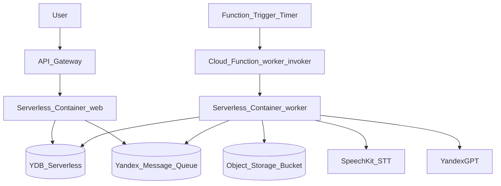

# Генератор конспектов лекций (Yandex Cloud)

Веб-приложение принимает **название лекции** и **публичную ссылку на видео** (Яндекс Диск/Яндекс 360), ставит задание в **YDB** и в **Yandex Message Queue**, а воркер асинхронно обрабатывает очередь и сохраняет готовый **PDF** в **Object Storage**.

## Архитектура



### Поток обработки
- **Web** (`src/main.py`):
  - `POST /tasks` создаёт запись в YDB со статусом «В очереди»
  - публикует `task_id` в Message Queue
  - редиректит на `/tasks`
- **Worker** (`src/worker.py`):
  - вызывается по HTTP (Serverless Container)
  - читает **одно** сообщение из очереди за один вызов
  - скачивает видео, извлекает аудио через `ffmpeg`
  - распознаёт речь через SpeechKit
  - генерирует конспект через YandexGPT
  - формирует PDF (ReportLab, шрифт DejaVuSans для кириллицы)
  - загружает PDF в Object Storage и обновляет статус в YDB
- **Invoker** (`terraform/worker_invoker/index.py`):
  - по таймеру вызывает endpoint воркера (чтобы воркер регулярно вычитывал очередь)

## Использованные сервисы Yandex Cloud
- **Yandex API Gateway**
- **Yandex Serverless Containers** (web + worker)
- **Yandex Cloud Functions** (invoker) + **Function Trigger (timer)**
- **Yandex Object Storage** (bucket для PDF)
- **Yandex Message Queue**
- **Yandex Managed Service for YDB** (serverless)
- **Yandex SpeechKit** (STT)
- **YandexGPT API**
- **Yandex Container Registry**
- **Yandex IAM / Resource Manager**

## Локальная структура репозитория
- `src/` — FastAPI web + worker
- `docker/` — Dockerfile для web/worker
- `terraform/` — инфраструктура в Yandex Cloud
- `deploy.ps1` — вспомогательные скрипты (если используете)

## Развёртывание

Ниже описан типичный сценарий: **собрать образы**, **запушить** в Container Registry, затем **terraform apply**.

### 0) Предварительно
- Установите:
  - Terraform
  - Docker
  - `yc` CLI (не обязательно)
- Получите:
  - `cloud_id`, `folder_id`
  - токен `YC_TOKEN` (или любой токен, который вы используете для провайдера Terraform)

### 1) Настроить переменные Terraform

Вариант A: задать `yc_token` через переменную Terraform.

Пример для PowerShell:

```powershell
cd terraform
terraform init
terraform apply -var "cloud_id=<CLOUD_ID>" -var "folder_id=<FOLDER_ID>" -var "prefix=<PREFIX>" -var "yc_token=$env:YC_TOKEN"
```

Вариант B: заполнить `terraform/terraform.tfvars`.

### 2) Выполнить скрипт deploy.ps1
```bash
./deploy.ps
```

После первого `terraform apply` в output появится `registry_id`.

### 3) Открыть приложение

URL берётся из output `api_gateway_url`:
- открыть главную страницу `/`
- создать задание
- проверить статус на `/tasks`

## Проверка работоспособности
- **Создание задания**: `POST /tasks` через веб-форму → редирект на `/tasks`
- **Обработка очереди**: раз в минуту invoker вызывает воркер, воркер вычитывает очередь
- **Готовый PDF**: появляется ссылка `/download/<object_key>` (перенаправляет на presigned URL из Object Storage)

## Примечания и ограничения
- Ссылки **disk.360.yandex.ru** часто являются HTML-страницей с плеером. Воркер пытается извлечь download-ссылку, но надёжнее использовать **прямую ссылку на скачивание**.
- SpeechKit синхронный endpoint ограничен по длине и весу аудио; в текущей реализации для длинных аудио используется упрощение (см. `recognize_speech_rest_api` в `src/worker.py`).


